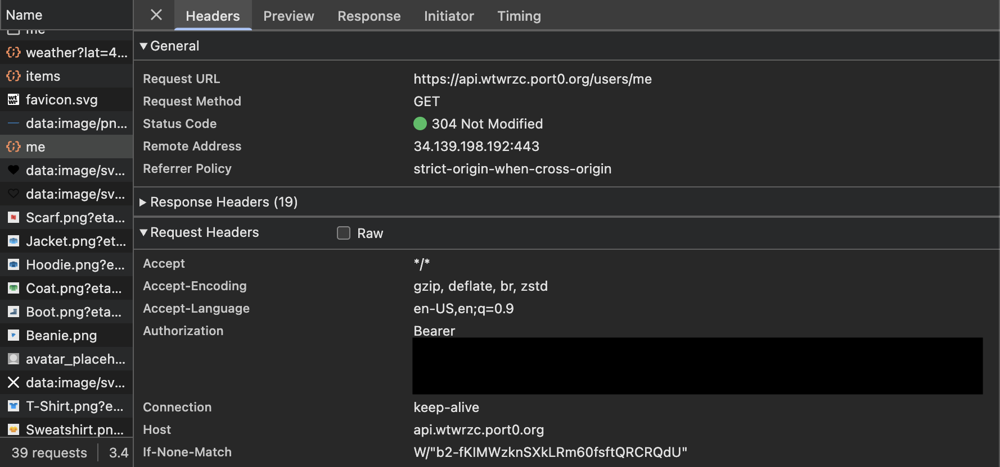
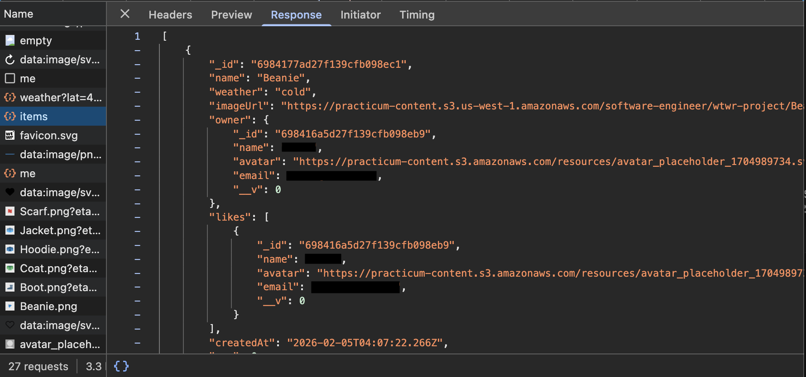

# WTWR – Backend API

Express and MongoDB backend supporting weather-based outfit recommendations and user-managed clothing items.

---

## 🌍 Deployment

Backend hosted on a cloud virtual machine with MongoDB database.

---

## 📸 Screenshots




---

## 📌 Overview

This API manages user accounts and clothing items for the WTWR application. Provides CRUD endpoints and secure authentication.

---

## 🛠 Tech Stack

- Node.js
- Express
- MongoDB
- JWT Authentication

---

## ✨ Key Features

- User authentication with JWT
- CRUD operations for clothing items
- Protected routes
- MongoDB schemas
- Request validation and centralized error handling

---

## ⚙️ Installation

```bash
git clone https://github.com/Zchabot/wtwr-backend.git
npm install
npm start
```
